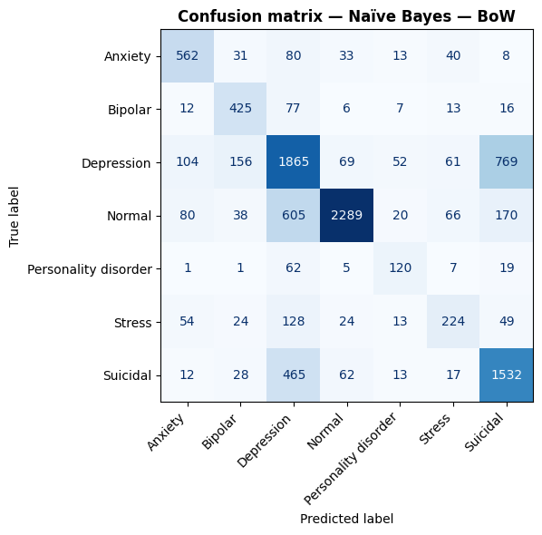
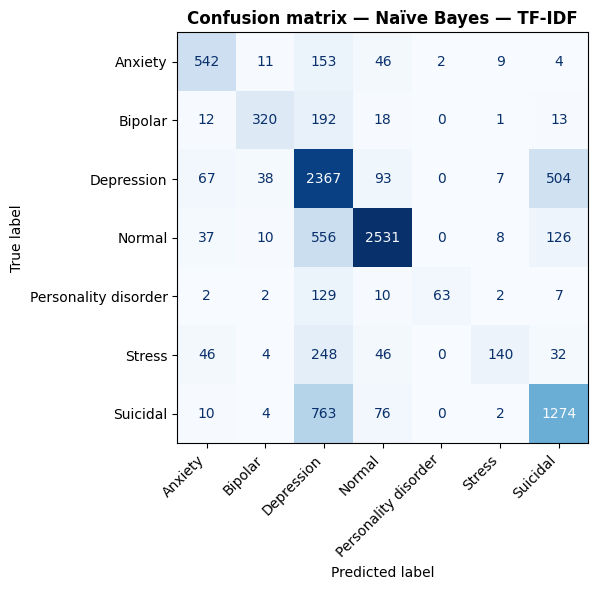
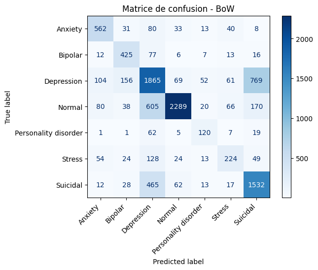
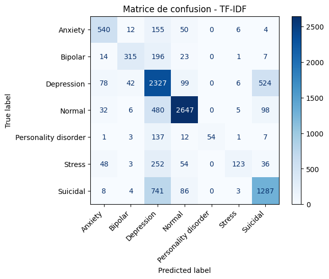
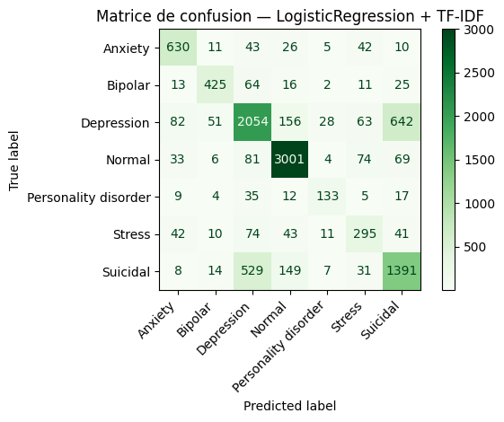

# Compte rendu — Étape 2 : Analyse des sentiments des conversations

**Projet** : Analyse de conversations patient-thérapeute sur la santé mentale   
**Date** : 30 avril 2026  
**Auteur du CR** : LARROUX Logan  
**Encadrante** : Lynda Tamine-Lechani

---

## 1. Contexte et organisation

L'étape 2 a divisé le groupe 1 en deux sous-groupes travaillant en parallèle sur le même jeu de données d'entraînement (`combined_data.csv`, *Sentiment Analysis for Mental Health* sur Kaggle), avec pour objectif commun d'annoter automatiquement le dataset principal `train.csv` en vue de sa transmission au Groupe 2.

| Sous-groupe | Méthode | Membres |
|---|---|---|
| Supervisé | Naive Bayes (BoW + TF-IDF) + Logistic Regression (TF-IDF) | Diogo, Ulysse, Logan |
| Non-supervisé | K-Means (Word2Vec + TF-IDF) | Emin, Victor |

Le pipeline commun aux deux sous-groupes comprend : nettoyage du texte, tokenisation (NLTK + Porter Stemmer), et vectorisation (BoW, TF-IDF, Word2Vec). Le split des données est identique pour les deux : **60% train / 20% validation / 20% test**, avec stratification sur les classes.

### 1.1. La différence entre supervisée et non-supervisée ?

**Une méthode supervisée** apprend à partir d'**exemples déjà étiquetés**. Cela veut dire que pour chaque entrée, on connaît la bonne réponse pendant l'entraînement. Le modèle apprend donc à faire une prédiction à partir de ces couples entrée-sortie.  
*Exemple*: classer des e-mails en spam / non-spam, prédire un prix, détecter une maladie à partir de symptômes etc.

**Une méthode non-supervisée**, quand à elle, apprend à partir de **données non étiquetées**. Ici, il n'y a pas de bonne réponse fournie au départ. Le but est plutôt de découvrir des structures cachées, des groupes ou des patterns dans les données.  
*Exemple*: regrouper des clients en segments, détecter des anomalies, réduire la dimension des données etc.

En résumé:
- Supervisée -> on connaît la réponse attendue.
- Non-supervisée -> on ne connaît pas la réponse, on cherche des structures.

### 1.2. Analyse et comparaison des résultats

Puisque le but de cette partie est de créer un modèle performant permettant de produire des étiquettes sur le dataset principal `train.csv`, nous allons devoir le définir en comparant les résultats des mesures suivante:
#### 1.2.1. Accuracy 
Définit un pourcentage de sentiments correctement prédits  

$$
    Accuracy = \frac{\text{Nb. de bonne prédictions}}{\text{Nb. total d'exemples}}
$$  

*Par exemple* on a 100 images:
- 87 bien classées
- 13 mal classées  

On a $\text{Accuracy} = \frac{87}{100} = 0.87$ donc **87%**.

#### 1.2.2. MSE (Mean Squared Error)
Définit l'erreur moyenne au carré entre la vraie valeur et celle prédite.  

$$
    MSE = \frac{1}{n}\sum{(y_i-\hat{y_i})^2}
$$  

Par exemple, on a les valeurs
- vraies: [10,20,30]
- prédites: [12,18,35]  

Ce qui correspond aux erreurs -2,+2,-5, mis au carré on a 4,4,25.  
Ce qui nous donnes la moyenne $(4+4+25)/3 = 11$
> Le carré permet de pénaliser fortement les grosses erreurs  

> Plus le MSE est proche de 0 mieux c'est
#### 1.2.3. R² (Coefficient de détermination)
Mesure combien le modèle explique la variance des données.  

$$
    R^2 = 1 - \frac{\text{Erreur modèle}}{\text{Erreur moyenne}}
$$  

Par exemple, si notre modèle suit bien les vrais sentiments d'un patient: $R^2 = 0.89$.
Cela signifie que le modèle explique **89% de la variabilité**.

#### 1.2.4. Classification Report
C'est un très grand résumé contenant d'autre variable à comparer.
- Precision — celui-ci pose la question *"parmi ce que j'ai prédit positif, **combien sont vraiment positifs ?**"*  

$$
    Precision = \frac{TP}{TP+FP}
$$  

- Recall — celui-ci pose la question "*parmi les vrais positifs, **combien j'en ai retrouvés ?***"  

$$  
    Recall = \frac{TP}{TP+FN}
$$

- F1-score — celui-ci est un compromis entre precision et recall:  

$$
    F1 = 2 \times\frac{Precision\times Recall}{Precision + Recall}
$$  

> TP = vrai positif  
  TN = vrai négatif  
  FP = faux positif  
  FN = faux négatif  

#### 1.2.5. Matrice de confusion
La matrice de confusion, elle, permet de visualiser les vraies classes des classes prédites.

*Par exemple*, voici une matrice de 3 classes comportant 120 chats/chiens/oiseaux

| | | | |
|--|--|--|--|
| Chat   | 100  |  20   |   0    |
| Chien  |  20  |  100  |   0    |
| Oiseau |   0  |   0   |   120  |
|        | Chat | Chien | Oiseau |

Les lignes correspondent aux vrais classes et les colonnes aux classes prédites, ici on remarque que le modèle a prédit correctement 100 chats mais a prédit 20 chats comme étant des chiens. De plus, il a prédit correctement 100 chiens mais a supposé 20 autres comme des chats.

#### 1.2.6. Purity Globale

La **Purity** est une mesure utilisée en **clustering** (méthodes non-supervisées).  
Elle permet de savoir si les groupes créés par l’algorithme contiennent majoritairement une seule vraie classe.

Autrement dit :

- un cluster est **pur** si presque tous ses éléments appartiennent à la même classe réelle ;
- plus la purity est élevée, plus les clusters sont cohérents.

La formule est :

$$
Purity = \frac{1}{N}\sum_k \max_j |C_k \cap L_j|
$$

Avec :

- $N$ = nombre total d’exemples,
- $C_k$ = cluster $k$,
- $L_j$ = classe réelle $j$.

Pour chaque cluster, on garde seulement la classe majoritaire.

*Exemple* :

- Cluster A : 20 chats, 3 chiens
- Cluster B : 18 chiens, 2 chats

On garde :

- 20 pour le cluster A
- 18 pour le cluster B

Donc :

$$
Purity = \frac{20+18}{43}=0.88
$$

Soit **88%**.

> Plus la Purity est proche de 1, meilleur est le regroupement.

> Attention : si chaque point forme son propre cluster, la purity vaut 1. Cette mesure peut donc être trompeuse seule.

---

#### 1.2.7. ARI (Adjusted Rand Index)

Le **ARI** mesure la similarité entre :

- les vrais labels
- les clusters trouvés

Il compare les paires de points :

- points qui devraient être ensemble
- points qui devraient être séparés

Puis il corrige le score pour tenir compte du hasard.

Sa valeur est comprise entre :

- **1** : clustering parfait
- **0** : résultat proche du hasard
- **< 0** : pire qu’un regroupement aléatoire

Contrairement à la Purity, l’ARI pénalise :

- un trop grand nombre de clusters,
- les mauvais regroupements,
- les résultats artificiellement bons.

> Plus l’ARI est proche de 1, meilleur est le clustering.

---

### 1.2.8. Résumé des mesures à comparer

| Mesure | Supervisée | Non-supervisée | Interprétation |
|--------|------------|----------------|----------------|
| Accuracy | Oui | Oui (après association clusters/classes) | Pourcentage de bonnes prédictions |
| MSE | Oui | Non | Erreur moyenne au carré |
| R² | Oui | Non | Variance expliquée |
| Precision | Oui | Non | Fiabilité des prédictions positives |
| Recall | Oui | Non | Capacité à retrouver les vrais positifs |
| F1-score | Oui | Non | Compromis Precision / Recall |
| Matrice de confusion | Oui | Oui | Détail des erreurs |
| Purity | Non | Oui | Pureté des clusters |
| ARI | Non | Oui | Similarité réelle clustering / labels |

---

### 1.2.9. Choix des mesures dans notre cas

Dans notre projet, nous cherchons à générer les meilleures étiquettes possibles sur `train.csv`.

Nous comparerons donc :

#### Pour les méthodes supervisées :

- Accuracy
- F1-score
- Classification report
- Matrice de confusion

#### Pour les méthodes non-supervisées :

- Accuracy (si correspondance possible entre clusters et labels)
- Matrice de confusion
- Purity
- ARI

Ainsi, nous pourrons comparer :

- la qualité brute de prédiction,
- la cohérence des regroupements,
- la robustesse globale des modèles.

---

## 2. Résultats par membre

### 2.1 Méthode supervisée — Naive Bayes (Diogo - Ulysse - Logan) et LogisticRegression (Logan)

### Tout d'abord, qu'est-ce que Naive Bayes ?
Naive Bayes répond à cette question: **"Étant donné les mots de ce texte, quelle est la catégorie la plus probable ?"**

C'est un classificateur probabiliste: plutôt que de tracer une frontière entre les classes comme le ferait un SVM (*Support Vector Machine*), il calcule une probabilité pour chaque classe et retourne celle qui est la plus élevée.

**Prennons un exemple:**

Imaginons lire des milliers de messages de patients, pour chaque mot, on note dans quelle catégorie il apparaît le plus souvent:

| Mots 	| Apparaissent surtout dans... |
|-|-|
| "hopeless", "empty", "worthless" 	| Depression |
| "panic", "nervous", "heart racing" 	| Anxiety |
| "fine", "better", "okay" 	| Normal |

Maintenant arrive un nouveau message: "I feel hopeless and nervous". Naive Bayes calcule:
- Proba que ce soit **Depression** → élevée (à cause de "hopeless")  
- Proba que ce soit **Anxiety** → élevée (à cause de "nervous")  
- Proba que ce soit **Normal** → faible  

Il tranche en faveur de la classe avec la probabilité totale la plus haute.

#### Le "Naïf" de Naive Bayes
Le modèle fait une hypothèse simplificatrice: il suppose que chaque mot est **indépendants** des autres. Autrement dit, il ignore complètement l'ordre et le contexte — pour lui, "I am not happy" et "I am happy not" **sont identiques**.

C'est évidemment faux en pratique, mais cette simplification rend le modèle très rapide à entraîner et étonnamment efficace sur les textes.

---

### Ensuite, qu'est ce que le LogisticRegression ?
La Régression Logistique répond à la question : **"Étant donné ce vecteur TF-IDF, à quelle classe ce texte appartient-il le plus probablement ?"**  

Contrairement à Naive Bayes qui calcule des probabilités indépendamment mot par mot, la Régression Logistique **apprend un poids pour chaque feature** (ici chaque n-gram TF-IDF), et combine ces poids pour produire un score par classe.

#### Pourquoi est-elle meilleure que Naive Bayes ici ?
| 	| Naive Bayes | Logistic Regression | 
|-|-|-|
| Hypothèse               | Mots indépendants  | Aucune hypothèse sur les features | 
| Frontière               | Probabiliste naïve | Frontière de décision optimisée | 
| Classes déséquilibrées  | Biais vers les classes majoritaires | Gère mieux avec class_weight='balanced' | 
| Corrélations entre mots | Ignorées | Prises en compte implicitement | 

Le paramètre clé est `C` (**inverse de la régularisation**) :  
- `C` petit → forte régularisation, modèle simple, **évite l'overfitting**  
- `C` grand → faible régularisation, modèle plus complexe, **peut overfit**

### 2.1.1 Diogo et Ulysse — Méthode supervisée (Naive Bayes BoW + TF-IDF)
Diogo et Ulysse ont produit les résultats de référence pour la méthode supervisée.

**Tuning de l'hyperparamètre `alpha` (Naive Bayes)** :
- Valeurs testées : `[0.001, 0.01, 0.05, 0.1, 0.5, 1.0, 2.0, 5.0]`
- Meilleur alpha BoW : **0.1** (*Accuracy: 0.6606*)
- Meilleur alpha TF-IDF : **0.05** (*Accuracy: 0.6761*)

**Résultats confirmés (NB + BoW)**

| Modèle | Accuracy test |
|---|---|
| Naive Bayes + BoW    | **0.6666** |

**Classification report (NB + BoW)** résumé :

| | precision | recall | f1- score |
|-|-|-|-|  
| Anxiety              | 0.68 | 0.73 | 0.71 |
| Bipolar              | 0.60 | 0.76 | 0.68 |
| Depression           | 0.57 | 0.61 | 0.59 |
| Normal               | 0.92 | 0.70 | 0.80 |
| Personality disorder | 0.50 | 0.56 | 0.53 |
| Stress               | 0.52 | 0.43 | 0.47 |
| Suicidal             | 0.60 | 0.72 | 0.65 |

**Observations** : Les performances reproduisent le profil connu du NB sur données déséquilibrées — très bonne précision sur les classes rares mais recall faible. *Personality disorder* et *Stress* sont systématiquement sous-détectés.

**Résultats confirmés (NB + TF-IDF)**

| Modèle | Accuracy test |
|---|---|
| Naive Bayes + TF-IDF | **0.6875** |  

**Classification report (NB + BoW)** résumé :

| | precision | recall | f1- score |
|-|-|-|-|  
| Anxiety              | 0.76 | 0.71 | 0.73 |       
| Bipolar              | 0.82 | 0.58 | 0.68 |       
| Depression           | 0.54 | 0.77 | 0.63 |      
| Normal               | 0.90 | 0.77 | 0.83 |      
| Personality disorder | 0.97 | 0.29 | 0.45 |     
| Stress               | 0.83 | 0.27 | 0.41 |       
| Suicidal             | 0.65 | 0.60 | 0.62 |      

**Observation** : TF-IDF est meilleur sur les deux classes les plus représentées (*Normal* et *Depression*), ce qui tire son accuracy globale vers le haut. Mais sur les 5 autres classes, **BoW gagne à chaque fois**, parfois très largement comme *Stress* (43% vs 27%) ou *Bipolar* (76% vs 58%)

> **Pourquoi ce phénomène ?**
**TF-IDF prénalise les mots fréquents**. C'est utile pour séparer *Normal* de *Depression*, mais pour les classes rares comme *Stress* ou *Personality disorder*, **leus mots caractéristiques sont précisément des mots fréquents** dans le corpus global (*overwhelmed*, *pressure*, *relationship*...).
TF-IDF les "dépouille" de leur signal, et le modèle, lui, les classe massivement en *Depression* faute d'indices.
Le cas *Personality disorder* avec TF-IDF est particulièrement frappant: **précision 0.98 mais recall 0.21** — le modèle est très sûr de lui quand il prédit cette classe, mais il rate 79% des vrais cas.

---

### 2.1.2 Logan — Méthode supervisée (notebook de référence commun + Logistic Regression)

Avec la grand aide de Diogo, Logan a produit le notebook de base structurant le travail commun. Sa contribution principale sur la partie individuelle est l'implémentation d'une **Régression Logistique** (LR + TF-IDF optimisé) en plus du Naive Bayes, identifiée comme « version extra-performante ».

**Paramétrage TF-IDF amélioré** :
- `ngram_range=(1,3)`, `max_features=50 000`, `sublinear_tf=True`, `min_df=2`, `max_df=0.95`

**Tuning de l'hyperparamètre `alpha` (Naive Bayes)** :
- Valeurs testées : `[0.001, 0.005, 0.01, 0.03, 0.05, 0.07, 0.1]`
- Meilleur alpha BoW : **0.1** (*Accuracy: 0.6606*) 
- Meilleur alpha TF-IDF : **0.07** (*Accuracy: 0.6816*)

**Résultats NB sur l'ensemble test** :

| Modèle | Accuracy test |
|---|---|
| Naive Bayes + BoW           | **0.6666** |
| Naive Bayes + TF-IDF        | **0.6927** |
| LogisticRegression + TF-IDF | **0.7532** |

**Classification report (NB + BoW/TF-IDF)** résumé :

| | precision (BoW) | recall (BoW) | f1-score (BoW) | precision (TF-IDF) | recall (TF-IDF) | f1-score (TF-IDF) | 
|-|-|-|-|-|-|-|
| Anxiety              | 0.68 | 0.73 | 0.71 | 0.75 | 0.70 | 0.73 |
| Bipolar              | 0.60 | 0.76 | 0.68 | 0.82 | 0.57 | 0.67 |
| Depression           | 0.57 | 0.61 | 0.59 | 0.54 | 0.76 | 0.63 |
| Normal               | 0.92 | 0.70 | 0.80 | 0.89 | 0.81 | 0.85 |
| Personality disorder | 0.50 | 0.56 | 0.53 | **1.00** | 0.25 | 0.40 |
| Stress               | 0.52 | 0.43 | 0.47 | 0.85 | 0.24 | 0.37 |
| Suicidal             | 0.60 | 0.72 | 0.65 | 0.66 | 0.60 | 0.63 |

> Les résultats sont presque identiques que ceux trouvés par Diogo et Ulysse, un point à noter est que parmi ce que TF-IDF a prédit posifif *pour Personality disorder*, 100% étaient vraiment positif (precision = 1.00). Cela peut paraitre très intéressant à première vue, mais on remarque que en réalité, il n'a trouvé que 25% des vrais positifs (recall = 0.25)...

**Tuning de l'hyperparamètre `C` (Logistic Regression)** :
- Valeurs testées : `[0.01, 0.05, 0.1, 0.3, 0.5, 1.0, 3.0, 5.0, 10.0]`
- Meilleur C TF-IDF : **3.0** (*Accuracy: 0.7457*)

**Classification report (LR + TF-IDF)** résumé :
| precision | recall | f1-score |
|-|-|-|
| Anxiety              | 0.77 | 0.82 | 0.80 |
| Bipolar              | 0.82 | 0.76 | 0.79 |
| Depression           | 0.71 | 0.67 | 0.69 |
| Normal               | 0.88 | 0.92 | 0.90 |
| Personality disorder | 0.70 | 0.62 | 0.66 |
| Stress               | 0.57 | 0.57 | 0.57 |
| Suicidal             | 0.63 | 0.65 | 0.64 |

**Comparaison F1-score entre NB+TF-IDF et LR-TF-IDF** :

| Classe | F1-score NB TF-IDF | F1-score LR TF-IDF | Évolution |
|---|---|---|---|
| Anxiety              | 0.73 | 0.80 | +0.07 |
| Bipolar              | 0.67 | 0.79 | +0.16 |
| Depression           | 0.63 | 0.69 | +0.06 |
| Normal               | 0.85 | 0.90 | +0.15 |
| Personality disorder | 0.40 | 0.66 | **+0.26** |
| Stress               | 0.37 | 0.57 | **+0.20** |
| Suicidal             | 0.63 | 0.64 | +0.01 |

On remarque que sur toute les classes, Logistic Regression a un meilleur score F1, en particulier sur *Personality disorder* et *Stress* mais cela n'est pas le seul point à prendre en compte:
- *Suicidal* est le gros problème, sur la matrice de confusion on remarque que sur 2129 vrais cas *Suicidal*, 1391 sont correctement classés **mais 529 sont prédit Depression**. C'est le problème le plus grave car c'est une classe à risque critique dans le contexte médical (confondre *Suicidal* avec *Depression* peut avoir des conséquences réelles...)
- **Depression a aussi un recall faible (0.67)**: 642 vrais Depression sont prédits Suicidal, et 156 Normal. Ces deux classes sont sémantiquement très proches dans le corpus.

**Modèle déployé sur `train.csv`** : **à déterminer**, les résultats de TF-IDF sont meilleurs dans les deux cas mais le choix doit se faire sur soit Naive Bayes soit Logistic Regression (puisque celui-ci n'était pas initialement demandé)

---

### 2.4 Emin & Victor — Méthode non-supervisée (K-Means)

Le sous-groupe non-supervisé a comparé deux approches de vectorisation pour K-Means : **TF-IDF + SVD** et **Word2Vec**.

#### Pipeline commun

- TF-IDF : `TruncatedSVD(n_components=100)` → normalisation L2
- Word2Vec : `vector_size=100`, `window=5`, `min_count=2` → normalisation L2 directe (pas de SVD nécessaire)
- Sélection de `k` par maximisation du **score silhouette cosinus** sur la validation, avec plancher à `y_train.nunique() = 7`

#### Résultats comparatifs K-Means

| Critère | K-Means + TF-IDF | K-Means + Word2Vec |
|---|---|---|
| Meilleur k retenu | 7 | 7 |
| **Accuracy sur test** | **0.4636** | 0.20 |
| Purity globale | **0.54** | 0.51 |
| **ARI** | **0.25** | 0.13 |
| Besoin de SVD ? | Oui | Non |
| Pureté max cluster | 0.85 (Depression) | 0.90 (Normal) |
| Pureté min cluster | 0.30 (Personality disorder) | 0.30 (Bipolar) |

#### Analyse des résultats

**Pourquoi TF-IDF surpasse Word2Vec ?**

Contra-intuitivement, TF-IDF (accuracy 46%) fait plus du double de Word2Vec (20%). L'hypothèse avancée par le sous-groupe : les catégories cliniques du dataset (*Depression*, *Anxiety*, etc.) se distinguent avant tout par un **vocabulaire symptomatique spécifique**, ce que TF-IDF met précisément en avant. Word2Vec, qui regroupe les mots par contexte sémantique large, tend à fusionner *Depression* et *Suicidal* dans les mêmes clusters (vocabulaire négatif proche), puis le mapping glouton force ces gros clusters sur des labels minoritaires, effondrant l'accuracy globale.

**Classes bien gérées / mal gérées** :

| Classe | Pureté TF-IDF | Pureté Word2Vec |
|---|---|---|
| Depression | 0.85 ✅ | 0.87 ✅ |
| Normal | 0.61 | 0.90 ✅ |
| Anxiety | 0.56 | 0.47 |
| Suicidal | 0.48 | 0.56 |
| Stress | 0.34 | 0.46 |
| Bipolar | 0.35 | 0.30 |
| Personality disorder | 0.30 | 0.37 |

**Décision du sous-groupe** : retenir **K-Means + TF-IDF** pour l'annotation.  
**Fichier produit** : `train_with_sentiments_kmeans.csv`.

---

## 3. Comparaison globale supervisé vs. non-supervisé

| Critère | Naive Bayes TF-IDF (supervisé) | K-Means + TF-IDF (non-supervisé) |
|---|---|---|
| **Accuracy sur test** | **0.6875** | 0.4636 |
| Macro avg F1 | 0.62 | — |
| Weighted avg F1 | 0.69 | — |
| Voit les labels à l'entraînement ? | Oui | Non |
| Hyperparamètre clé | alpha = 0.05 | k = 7 |
| Fichier annoté | `train_with_sentiments.csv` | `train_with_sentiments_kmeans.csv` |

**Écart** : +22 points d'accuracy en faveur du supervisé. Cet écart est cohérent et attendu : le supervisé a accès aux vrais labels pendant l'entraînement, le non-supervisé pas. Les deux méthodes utilisent la même représentation TF-IDF, donc l'écart reflète purement la différence supervisé/non-supervisé.

**Problèmes communs aux deux approches** : les mêmes classes sont difficiles pour les deux méthodes (*Personality disorder*, *Stress*, confusion *Depression*/*Suicidal*). Cela pointe vers une limite des données elles-mêmes (classes sous-représentées et vocabulaire qui se chevauche), plutôt qu'un problème algorithmique.

---

## 4. Décision finale : modèle transmis au Groupe 2

**→ Modèle retenu : Naive Bayes + TF-IDF (notebook de Diogo/Logan)**

| Critère | Justification |
|---|---|
| Accuracy 68.75% | Meilleure performance absolue parmi tous les modèles testés |
| Annotations fiables | Les labels transmis au Groupe 2 doivent être les plus corrects possible pour que le filtrage par sentiments soit utile |
| Modèle léger | NB est rapide à déployer et à sérialiser (`.pkl`) |

**Fichier à transmettre au Groupe 2** : `train_with_sentiments.csv`  
**Colonne d'annotation** : `predicted_sentiment`  
**Classes prédites** : `Anxiety`, `Bipolar`, `Depression`, `Normal`, `Personality disorder`, `Stress`, `Suicidal`

> **Note pour le Groupe 2** : la précision sur *Personality disorder* et *Stress* reste faible (recall ~25–30%). Ces classes sont sous-annotées dans le dataset source. Il est conseillé de traiter les réponses filtrées sur ces deux classes avec prudence, ou d'élargir le seuil de similarité pour compenser.

---

## 5. Points de vigilance et perspectives

- **Déséquilibre des classes** : *Depression* est sur-représentée dans `combined_data.csv`, ce qui biaise tous les modèles. Une solution (non implémentée faute de temps) serait le sur-échantillonnage SMOTE ou l'ajustement de `class_weight`.
- **Confusion Depression / Suicidal** : problème critique dans le contexte médical. La LR avec régularisation L1 (testée par Logan) améliore ce point mais le temps d'entraînement est prohibitif (~4h). À envisager si plus de ressources de calcul sont disponibles.
- **R² non pertinent** : cette métrique ne doit pas être utilisée pour évaluer des classifieurs multi-classes à labels nominaux. L'accuracy, le F1-score et la matrice de confusion sont les indicateurs à retenir.
- **Amélioration possible** : la Logistic Regression (LR + TF-IDF, `class_weight='balanced'`) de Logan est prometteuse (+12 à +41% de recall sur les classes minoritaires) et devrait être envisagée comme version finale si le temps le permet.